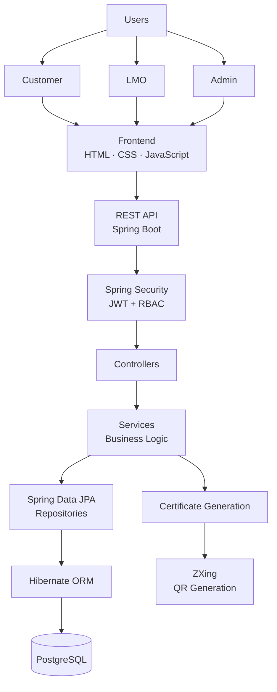
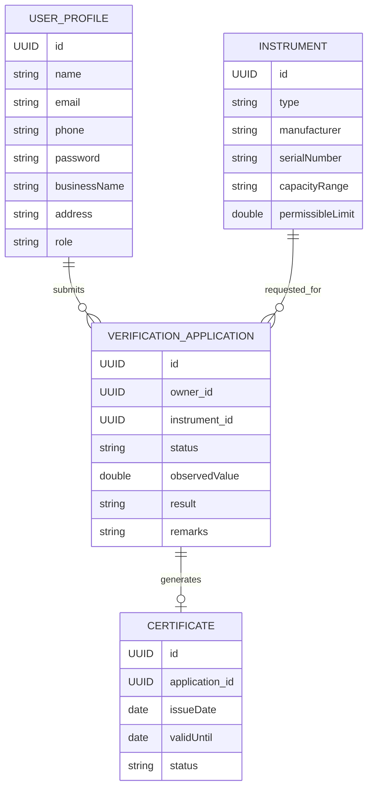

<div align="center">

# ⚖️ METRIFY

### Digital Legal Metrology Verification & Certification Platform

**A secure, role-based platform for digitizing the verification lifecycle of weighing and measuring instruments.**

<br/>


<br/>

**Smart India Hackathon 2026 · Problem Statement 26036 · Team Tech4Grace**

<br/>

[✨ Features](#-key-features) ·
[🏗️ Architecture](#️-architecture) ·
[🚀 Setup](#-getting-started) ·
[📡 APIs](#-api-reference) ·
[🔐 Security](#-security) ·
[🗺️ Roadmap](#️-roadmap)

</div>

---

## 🚀 What is Metrify?

**Metrify** is a digital platform designed to streamline the Legal Metrology verification lifecycle for weighing and measuring instruments.

Instead of treating application submission, officer assignment, inspection, verification and certification as disconnected activities, Metrify brings them together into a **single digital workflow**.

```text
┌──────────────┐
│   Customer   │
└──────┬───────┘
       │
       │ Application
       ▼
┌────────────────────┐
│ Application System │
└─────────┬──────────┘
          │
          │ Assignment
          ▼
┌────────────────────┐
│        LMO         │
│ Legal Metrology    │
│ Officer            │
└─────────┬──────────┘
          │
          │ Inspection
          ▼
┌────────────────────┐
│ Verification Engine│
└─────────┬──────────┘
          │
     ┌────┴────┐
     ▼         ▼
   PASS       FAIL
     │
     ▼
┌────────────────────┐
│ Digital Certificate│
└─────────┬──────────┘
          │
          ▼
      QR Verification
```

### The goal

> **Digitize the complete journey from application to verification and certification while improving security, traceability and transparency.**

---

# 🏆 Smart India Hackathon 2026

|                       |                                                                                     |
| --------------------- | ----------------------------------------------------------------------------------- |
| **Problem Statement** | Development of an Weighing and Online Verification System for Measuring Instruments |
| **PS ID**             | 26036                                                                               |
| **Theme**             | Transportation & Logistics                                                          |
| **Category**          | Software                                                                            |
| **Team**              | Tech4Grace                                                                          |
| **Project**           | Metrify                                                                             |

---

# 🎯 The Problem

The verification of weighing and measuring instruments can involve multiple stakeholders and several operational steps.

Traditional or fragmented workflows can create difficulties such as:

* Manual application handling
* Paper-based documentation
* Difficulty tracking application status
* Officer coordination overhead
* Fragmented records
* Manual certificate management
* Limited visibility into the verification lifecycle
* Difficulty validating certificates

Metrify addresses these challenges by creating a **centralized digital workflow**.

---

# 💡 Our Approach

Metrify connects three primary system roles:

| Role            | Responsibility                              |
| --------------- | ------------------------------------------- |
| 👤 **Customer** | Submit applications and track verification  |
| 👨‍🔧 **LMO**   | Perform instrument verification             |
| 👨‍💼 **Admin** | Manage applications and officer assignments |

The platform follows a clear lifecycle:

```text
SUBMIT
   ↓
PENDING
   ↓
ASSIGNED
   ↓
IN PROGRESS
   ↓
VERIFIED
   ↓
PASS / FAIL
   ↓
CERTIFICATE
   ↓
QR VERIFICATION
```

---

# ✨ Key Features

## 👤 Customer Portal

* Secure registration and login
* Customer dashboard
* Instrument verification application
* Application tracking
* Verification status
* Verification result
* Digital certificate access
* QR-based certificate verification

---

## 👨‍🔧 LMO Portal

* Secure LMO authentication
* Assigned verification tasks
* Application details
* Instrument information
* Field verification workflow
* Observed measurement submission
* Backend-driven PASS/FAIL determination
* Verification history

---

## 👨‍💼 Admin Portal

* Application monitoring
* Officer management
* Application assignment
* Dashboard statistics
* Administrative reports
* Workflow monitoring

---

# 📸 Product Preview

> **Screenshots should be placed in `docs/screenshots/`.**

### Login


*Secure role-aware login interface.*

---

### Customer Dashboard


*Customer view for tracking applications and verification status.*

---

### LMO Dashboard


*LMO workspace for managing verification tasks.*

---

### Admin Dashboard


*Administrative view for application and officer management.*

---

### Verification Workflow


*Digital verification workflow with system-driven result determination.*

---

# 🏗️ Architecture

Metrify follows a layered full-stack architecture.



---

# 🔄 End-to-End Request Flow

A typical request follows:

```text
Browser
   │
   │ HTTP Request
   ▼
REST API
   │
   ▼
Spring Security
   │
   ├── JWT Validation
   └── Role Authorization
   │
   ▼
Controller
   │
   ▼
Service
   │
   ▼
Repository
   │
   ▼
Hibernate / JPA
   │
   ▼
PostgreSQL
   │
   ▼
JSON Response
   │
   ▼
Frontend
```

---

# 🧱 Backend Architecture

Metrify uses a layered Spring Boot architecture.

```text
┌────────────────────────────────────┐
│             Controller             │
│       Handles HTTP requests        │
└──────────────────┬─────────────────┘
                   │
                   ▼
┌────────────────────────────────────┐
│              Service              │
│        Business logic             │
└──────────────────┬─────────────────┘
                   │
                   ▼
┌────────────────────────────────────┐
│             Repository             │
│       Database operations          │
└──────────────────┬─────────────────┘
                   │
                   ▼
┌────────────────────────────────────┐
│          JPA / Hibernate           │
│        Object-relational mapping   │
└──────────────────┬─────────────────┘
                   │
                   ▼
┌────────────────────────────────────┐
│            PostgreSQL              │
└────────────────────────────────────┘
```

---

# 🛠️ Technology Stack

### Frontend

* HTML5
* CSS3
* JavaScript
* Browser Geolocation API
* REST API integration

### Backend

* Java 21
* Spring Boot
* Spring Web
* Spring Security
* Spring Data JPA
* Hibernate
* Maven

### Database

* PostgreSQL

### Security

* JWT
* BCrypt
* Spring Security
* Role-Based Authorization

### Verification & Documents

* ZXing
* Java PDF generation

### Development

* Git
* GitHub
* VS Code

---

# 🔐 Security Architecture

Security is a core part of Metrify.

```text
                   LOGIN
                     │
                     ▼
             Email + Password
                     │
                     ▼
              BCrypt Verification
                     │
                     ▼
                  JWT
                     │
                     ▼
              Frontend Client
                     │
                     │ Bearer Token
                     ▼
          ┌─────────────────────┐
          │ JwtAuthentication    │
          │ Filter               │
          └──────────┬──────────┘
                     │
                     ▼
              Validate Token
                     │
                     ▼
              Identify User
                     │
                     ▼
              Check User Role
                     │
          ┌──────────┼──────────┐
          ▼          ▼          ▼
      CUSTOMER      LMO        ADMIN
```

---

# 🔑 Authentication

Metrify uses **JWT-based authentication**.

After successful login:

```text
Email + Password
       ↓
Spring Security
       ↓
BCrypt
       ↓
JWT Generated
       ↓
Frontend
```

Protected requests contain:

```http
Authorization: Bearer <JWT>
```

The backend validates the token before processing the request.

---

# 👥 Role-Based Authorization

Authentication answers:

> **Who are you?**

Authorization answers:

> **What are you allowed to access?**

Metrify uses:

```text
CUSTOMER
LMO
ADMIN
```

API access is separated accordingly:

```text
/api/customer/**  → CUSTOMER

/api/lmo/**       → LMO

/api/admin/**     → ADMIN
```

A valid JWT alone does not grant access to every API.

The user's role must also match the endpoint's authorization requirement.

---

# 🔒 Password Security

Passwords are never intended to be stored as plain text.

Metrify uses **BCryptPasswordEncoder**.

```text
Plain Password
      │
      ▼
   BCrypt
      │
      ▼
Password Hash
      │
      ▼
 PostgreSQL
```

During login, Spring Security verifies the supplied password against the stored BCrypt hash.

---

# 🗄️ Data Model

The core domain model contains several entities.



---

# 📊 Core Entities

## UserProfile

Stores authenticated user information and role.

```text
id
name
email
phone
password
businessName
address
role
```

---

## Instrument

Stores information about the instrument being verified.

```text
id
type
manufacturer
serialNumber
capacityRange
permissibleLimit
```

---

## VerificationApplication

Represents a customer's verification request.

```text
id
owner
instrument
status
observedValue
result
remarks
```

---

## Certificate

Represents the digital verification certificate.

```text
id
application
issueDate
validUntil
status
```

---

# 📡 REST API

Metrify exposes REST APIs through Spring Boot.

## Authentication

| Method | Endpoint              | Purpose           |
| ------ | --------------------- | ----------------- |
| `POST` | `/api/users/register` | Register user     |
| `POST` | `/api/users/login`    | Authenticate user |

---

## Applications

| Method   | Endpoint                 | Purpose               |
| -------- | ------------------------ | --------------------- |
| `POST`   | `/api/applications`      | Create application    |
| `GET`    | `/api/applications`      | Retrieve applications |
| `GET`    | `/api/applications/{id}` | Retrieve application  |
| `DELETE` | `/api/applications/{id}` | Delete application    |

---

## Instruments

| Method | Endpoint           | Purpose              |
| ------ | ------------------ | -------------------- |
| `POST` | `/api/instruments` | Add instrument       |
| `GET`  | `/api/instruments` | Retrieve instruments |

---

## Verification

| Method | Endpoint                            | Purpose            |
| ------ | ----------------------------------- | ------------------ |
| `POST` | `/api/verification/{applicationId}` | Verify application |

---

## Customer APIs

| Method | Endpoint                          | Purpose                 |
| ------ | --------------------------------- | ----------------------- |
| `GET`  | `/api/customer/dashboard`         | Customer dashboard      |
| `GET`  | `/api/customer/applications`      | Customer applications   |
| `GET`  | `/api/customer/applications/{id}` | Application details     |
| `GET`  | `/api/customer/certificates`      | Certificates            |
| `GET`  | `/api/customer/certificates/qr`   | QR certificate workflow |

---

## LMO APIs

| Method | Endpoint                 | Purpose              |
| ------ | ------------------------ | -------------------- |
| `GET`  | `/api/lmo/dashboard`     | LMO dashboard        |
| `GET`  | `/api/lmo/tasks`         | Assigned tasks       |
| `GET`  | `/api/lmo/verifications` | Verification records |
| `GET`  | `/api/lmo/history`       | Verification history |
| `GET`  | `/api/lmo/notifications` | Notifications        |

---

## Admin APIs

| Method | Endpoint                  | Purpose             |
| ------ | ------------------------- | ------------------- |
| `GET`  | `/api/admin/dashboard`    | Admin dashboard     |
| `GET`  | `/api/admin/applications` | Manage applications |
| `POST` | `/api/admin/assign`       | Assign LMO          |
| `GET`  | `/api/admin/officers`     | Officer information |
| `GET`  | `/api/admin/reports`      | Reports             |

> **Note:** Some frontend endpoints are part of the planned integration structure and may require further backend implementation before production deployment.

---

# ⚙️ Verification Engine

The prototype implements backend-driven verification.

```text
Observed Measurement
          │
          ▼
Retrieve Application
          │
          ▼
Retrieve Instrument
          │
          ▼
Retrieve Permissible Limit
          │
          ▼
Compare Values
          │
      ┌───┴───┐
      ▼       ▼
    PASS     FAIL
      │       │
      └───┬───┘
          ▼
Update Application
```

The important architectural principle is:

> **The frontend does not decide the verification result.**

The backend performs the verification logic.

### Production consideration

The current prototype uses a simplified configurable permissible limit.

A production implementation should incorporate the applicable Legal Metrology requirements for the relevant instrument category, class, capacity and verification conditions.

---

# 📍 Location Verification

The LMO workflow supports browser-based geolocation.

The prototype uses a **150 m allowed radius** for the location check.

```text
LMO Device
    │
    ▼
Browser Geolocation
    │
    ▼
Coordinates
    │
    ▼
Compare with Verification Location
    │
    ▼
Within Allowed Radius?
```

This provides an additional layer of field-verification evidence.

---

# 📱 QR Verification

Metrify can use **ZXing (Zebra Crossing)** for QR-code generation.

```text
Certificate
     │
     ▼
Unique Certificate Identifier
     │
     ▼
ZXing
     │
     ▼
QR Code
     │
     ▼
Scan
     │
     ▼
Verification Endpoint
     │
     ▼
Certificate Information
```

The QR code can contain a certificate identifier or verification URL.

---

# 📄 Digital Certificates

The platform is designed to generate digital verification certificates.

A certificate may contain:

```text
┌─────────────────────────────────────┐
│       LEGAL METROLOGY               │
│    VERIFICATION CERTIFICATE         │
│                                     │
│ Certificate ID: XXXXXXXX            │
│                                     │
│ Owner:              XXXXX           │
│ Instrument:         XXXXX           │
│ Manufacturer:      XXXXX            │
│ Serial Number:     XXXXX            │
│                                     │
│ Result:             PASS            │
│ Issue Date:         XX/XX/XXXX      │
│ Valid Until:        XX/XX/XXXX      │
│                                     │
│              [ QR CODE ]            │
└─────────────────────────────────────┘
```

Java-based PDF generation can be used to produce the certificate as a downloadable document.

---

# 🚀 Getting Started

## Prerequisites

Install:

* **Java 21**
* **PostgreSQL**
* **Git**
* **VS Code** or another Java IDE

Maven does not need to be installed separately because the project includes the Maven Wrapper.

---

## 1. Clone the Repository

```bash
git clone <repository-url>
cd legal-meterology
```

---

## 2. Create the Database

Create a PostgreSQL database named:

```text
legal_metrology
```

---

## 3. Configure Database Credentials

Configure your local database connection in:

```text
src/main/resources/application.properties
```

**Do not commit database passwords or secrets to Git.**

---

## 4. Configure JWT Secret

The backend expects:

```text
JWT_SECRET
```

On Windows PowerShell:

```powershell
$env:JWT_SECRET="YOUR_BASE64_SECRET"
```

Use a securely generated secret.

Never commit the JWT secret to the repository.

---

## 5. Start the Backend

### Windows

```powershell
.\mvnw.cmd spring-boot:run
```

### Linux / macOS

```bash
./mvnw spring-boot:run
```

The backend runs on:

```text
http://localhost:8080
```

---

# 🧪 Example API Flow

## Register

```http
POST /api/users/register
Content-Type: application/json
```

Example request:

```json
{
  "name": "Test User",
  "email": "user@example.com",
  "phone": "9876543210",
  "password": "your-password",
  "businessName": "Demo Business",
  "address": "Demo Address"
}
```

The backend creates the user and stores the password as a BCrypt hash.

---

## Login

```http
POST /api/users/login
Content-Type: application/json
```

The backend verifies the credentials and returns authentication information including a JWT.

---

## Authenticated Request

```http
GET /api/customer/dashboard
Authorization: Bearer <JWT>
```

The JWT is validated before the protected endpoint is executed.

---

# 🧪 Testing

Recommended tools:

* Postman
* PowerShell
* Browser
* Frontend application

A typical test sequence is:

```text
1. Register user
       ↓
2. Login
       ↓
3. Receive JWT
       ↓
4. Call protected API
       ↓
5. Verify authorization
       ↓
6. Create instrument
       ↓
7. Create application
       ↓
8. Submit observed value
       ↓
9. Verify PASS / FAIL
```

---

# 🧩 Project Structure

```text
legal-meterology/
│
├── src/
│   └── main/
│       ├── java/
│       │   └── com/example/legal_meterology/
│       │       │
│       │       ├── controller/
│       │       ├── entity/
│       │       ├── repository/
│       │       ├── service/
│       │       └── security/
│       │
│       └── resources/
│           └── application.properties
│
├── frontend/
│   └── ...
│
├── docs/
│   └── screenshots/
│       ├── login.png
│       ├── customer-dashboard.png
│       ├── lmo-dashboard.png
│       ├── admin-dashboard.png
│       └── verification.png
│
├── pom.xml
├── mvnw
├── mvnw.cmd
└── README.md
```

---

# 📈 Scalability

Metrify is designed with separation between:

```text
Frontend
    │
    ▼
REST API
    │
    ▼
Backend
    │
    ▼
Database
```

This architecture allows future scaling of the backend independently from the frontend.

Potential production enhancements include:

* HTTPS
* Reverse proxy
* Load balancing
* Containerization
* Cloud deployment
* Horizontal backend scaling
* Database backups
* Centralized logging
* Monitoring
* Rate limiting
* Automated deployment

These are future production enhancements and are not represented as already-deployed components of the prototype.

---

# 🛡️ Security Considerations

Metrify is designed around several security principles.

### Password Protection

BCrypt password hashing.

### Authentication

JWT-based stateless authentication.

### Authorization

Role-based API access.

### Database Constraints

Unique constraints for important identifiers such as email and instrument serial number.

### Secret Management

JWT secrets and database credentials should be supplied through environment variables or secure deployment configuration.

### Repository Security

Before production or public release, the repository should use GitHub's security features such as secret scanning, push protection, Dependabot and code scanning where appropriate.

---

# 📊 Prototype vs Production

| Component      | Current Prototype   | Production Direction            |
| -------------- | ------------------- | ------------------------------- |
| Authentication | JWT                 | JWT + hardened deployment       |
| Passwords      | BCrypt              | BCrypt + security policies      |
| Database       | PostgreSQL          | Managed/scalable PostgreSQL     |
| Verification   | Simplified rule     | Regulation-driven rules engine  |
| QR             | Planned/integration | Certificate verification        |
| PDF            | Planned/integration | Digitally generated certificate |
| Geolocation    | Browser API         | Stronger field verification     |
| Notifications  | Planned             | Email/SMS/push                  |
| Deployment     | Local/prototype     | Cloud/container deployment      |
| Monitoring     | Planned             | Centralized monitoring/logging  |

---

# 🗺️ Roadmap

### Phase 1 — Core Platform

* [x] Spring Boot backend
* [x] PostgreSQL integration
* [x] User registration
* [x] BCrypt password hashing
* [x] JWT authentication
* [x] Role-based authorization
* [x] Instrument management
* [x] Application management
* [x] Basic verification logic

### Phase 2 — Full Workflow

* [ ] Complete customer API integration
* [ ] Complete LMO API integration
* [ ] Complete admin API integration
* [ ] Application assignment workflow
* [ ] Complete certificate workflow
* [ ] QR verification

### Phase 3 — Production Features

* [ ] Regulation-driven verification engine
* [ ] Digital signatures
* [ ] Audit trail
* [ ] Notifications
* [ ] Advanced analytics
* [ ] Mobile application
* [ ] Production deployment
* [ ] Monitoring and observability

---

# 🌟 Why Metrify?

### One Platform

Bring customers, LMOs and administrators into one system.

### Secure by Design

JWT authentication, BCrypt password hashing and role-based authorization.

### Automated Verification

Move verification logic into the backend rather than relying on frontend decisions.

### Traceable

Applications, instruments, verification records and certificates can be associated through persistent identifiers.

### Digitally Verifiable

QR-enabled certificates provide a convenient path toward certificate verification.

### Scalable Architecture

REST APIs and layered backend architecture allow future clients and services to integrate with the platform.

---

# 🧠 Design Principles

Metrify is built around five core principles:

```text
       ┌───────────────┐
       │   SECURITY    │
       └───────┬───────┘
               │
┌──────────────┼──────────────┐
│              │              │
▼              ▼              ▼
TRUST      TRACEABILITY   AUTOMATION
│              │              │
└──────────────┼──────────────┘
               │
               ▼
        DIGITAL ACCESS
```

### Security

Protect users and APIs.

### Transparency

Allow stakeholders to track the verification lifecycle.

### Traceability

Maintain identifiable records throughout the workflow.

### Automation

Reduce unnecessary manual operations.

### Accessibility

Make verification information easier to access digitally.

---

# 👥 Team

## Tech4Grace

### Smart India Hackathon 2026

**Problem Statement:** 26036
**Theme:** Transportation & Logistics
**Project:** Metrify

---

# 📚 References

The project is developed in the context of the Legal Metrology ecosystem and references relevant:

* Legal Metrology legislation and rules
* Consumer Affairs resources
* OIML recommendations
* ISO/IEC 27001 security principles

Production implementation should always use the applicable and current regulatory requirements for the specific instrument category and verification process.

---

# ⚠️ Project Status

<div align="center">

### 🟡 Prototype / Hackathon Development

Metrify is currently being developed as a prototype for **Smart India Hackathon 2026**.

</div>

The backend already demonstrates core capabilities including:

* Spring Boot REST APIs
* PostgreSQL persistence
* JPA/Hibernate
* BCrypt
* JWT authentication
* Role-based authorization
* Instrument management
* Application management
* Backend verification logic

Some frontend workflows continue to use controlled prototype/demo data while the complete frontend-to-backend integration is being progressively implemented.

---

# 🤝 Contributing

Contributions and suggestions are welcome during development.

A typical workflow is:

```text
Create Branch
     ↓
Implement Feature
     ↓
Test
     ↓
Commit
     ↓
Pull Request
     ↓
Code Review
     ↓
Merge
```

For team development, avoid committing secrets, local configuration files or generated build artifacts.

---

# 📜 License

This project is developed by **Tech4Grace** as part of **Smart India Hackathon 2026**.


---

<div align="center">

## ⚖️ Metrify

### Making Legal Metrology verification more digital, secure and traceable.

**Built by Tech4Grace · Smart India Hackathon 2026**

<br/>

⭐ **If you find this project interesting, consider starring the repository.**

</div>
